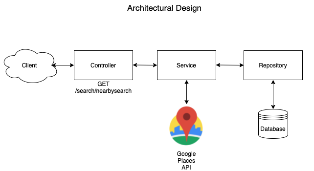
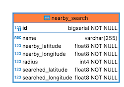
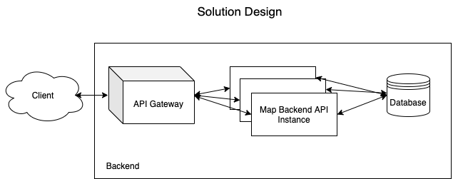

# Nearby Search Backend Application

This backend application has one endpoint which accepts longitude, latitude, radius values as a query parameter to make a nearby
search request via Google Places API and return the result as response. The API feeds [Nearby Search Frontend Application](https://github.com/meteergin/map-frontend/blob/master/README.md).

## Work Process

API accepts GET requests as REST API on port 8070. For example;
```bash
curl http://localhost:8070/search/nearbysearch?latitude=-33.8670522&longitude=151.1957362&radius=200
```
The responses from the Google Places API are recorded and if the same request comes again, the response is returned from the DB without the need to make the same query to the Google Places API again.


## Usage

Use the [docker-compose](https://github.com/meteergin/map-backend/blob/master/docker/docker-compose.yml) file to set postgresql database.

```bash
docker-compose up
```

Build the application to generate jar file.

```maven
mvn clean install
```

Under target directory run;

```bash
java -jar map-backend-0.0.1-SNAPSHOT.jar
```

## Architectural Design


## Database Model


## Solution Desgin

